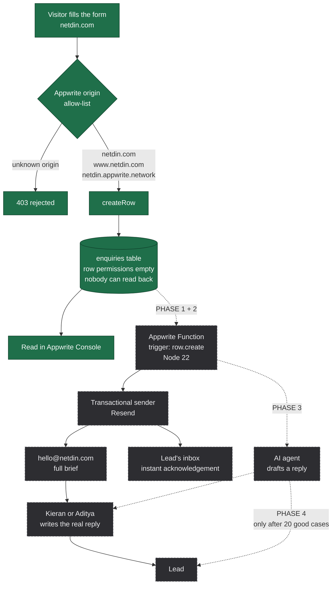

# Netdin — Lead Capture and Response Plan

Quick reference for how an enquiry travels from the website to a reply, what is
live today, and what is planned. Skim the diagram first; read only the section
you need.

Last updated: 2026-09-24

---

## Pipeline at a glance

Solid green = built and verified. Dashed grey = not built yet.

---

## Current state (verified 2026-09-24)

- **Site**: live at `https://netdin.com`, HTTP 200, TLS valid to 22 Oct 2026
- **Hosting**: Appwrite Sites, project `6aa51b7900301ddf37b8`, region `nyc`
- **DNS**: delegated to `ns1/ns2.appwrite.zone`. BigRock holds the registration only, its zone is inert
- **Database**: `netdin` / table `enquiries`, 10 columns, `create("any")` + row security on
- **Write path**: proven with a live submission, `201 Created`, row stored, then deleted
- **Security**: unauthenticated read returns zero rows, unauthenticated delete returns 401
- **Email**: `hello@netdin.com` is a Zoho group delivering to `kieran@` and `aditya.saini@`
- **Mail auth**: MX (10/20/50 `mx*.zoho.in`), SPF, DKIM all published and verified

### Reference values

| Item | Value |
|---|---|
| Appwrite endpoint | `https://nyc.cloud.appwrite.io/v1` |
| Project ID | `6aa51b7900301ddf37b8` |
| Database ID | `netdin` |
| Table ID | `enquiries` |
| Domain ID (DNS) | `504708cfd73822e0767391b18d8e5fe8` |
| Repo | `Memphis1983/netdin`, upstream `sainilabs/netdin` |

### Known quirks

- Appwrite's DNS publisher is slow. New records take **8 to 60 minutes** to reach
  the nameservers. Watch the SOA serial increment to confirm a rebuild.
- All four `VITE_APPWRITE_*` variables must be set in Appwrite Sites **before** the
  build. Vite inlines them, so setting them afterwards does nothing. Run
  `node scripts/check-deployment.mjs <url>` to confirm any deployment.
- Only **one** SPF record is allowed per domain. New senders get merged into the
  existing record, never added as a second one.

---

## Phase 1 — Instant acknowledgement to the lead

- **Title**: fixed-template auto-reply, no AI
- **Action performed**: not started
- **Requirements**
  - Transactional sending account (Resend recommended) with `netdin.com` verified
  - Resend's DNS records added in Appwrite, SPF merged into the existing record
- **Execution**
  1. Create Appwrite Function, Node 22, trigger `rows.*.create` on `enquiries`
  2. Read the new row from the event payload
  3. Send one templated email to the address in the row
  4. Copy states that a human replies within one working day
- **Result expected**: the lead knows the form worked within seconds. Removes the
  "did that send?" doubt that makes people email twice or give up
- **Effort**: about 30 minutes once Resend is verified
- **Why first**: zero risk, no AI, and it solves the actual anxiety

## Phase 2 — Internal notification to the team

- **Title**: full brief emailed to `hello@netdin.com`
- **Action performed**: not started
- **Requirements**: same Function and sender as Phase 1
- **Execution**
  1. In the same Function, send a second email to `hello@netdin.com`
  2. Include every field: name, email, company, services, budget, timeline, message
  3. Add a direct link to the row in the Appwrite Console
- **Result expected**: leads arrive in the shared inbox in real time. No one has to
  remember to check the Console
- **Effort**: about 30 minutes, same sitting as Phase 1
- **Why it matters**: this is currently the largest gap. A brief submitted on a
  Friday is invisible until someone happens to look

## Phase 3 — AI drafts, human sends

- **Title**: AI-assisted reply drafting with human approval
- **Action performed**: not started
- **Requirements**
  - A written company knowledge base: services, pricing approach, process,
    timelines, what Netdin does not do
  - An LLM provider and prompt, grounded strictly on that knowledge base
- **Execution**
  1. Function passes the brief to the model
  2. Model returns a draft reply
  3. Draft is included in the `hello@` notification email
  4. A human edits and sends it. The AI never contacts the lead
- **Result expected**: reply time drops from hours to minutes of effort, with a
  human still accountable for every word a prospect reads
- **Effort**: days, dominated by writing the knowledge base
- **Blocker**: the knowledge base does not exist yet. Pricing is undecided and
  there are no case studies

## Phase 4 — AI replies directly, escalates when unsure

- **Title**: autonomous first-line response with human handoff
- **Action performed**: not started
- **Requirements**
  - Phase 3 running for at least **20 real enquiries** with drafts reviewed as good
  - Confidence threshold and an explicit escalation path
  - Logging of every AI reply for audit
- **Execution**
  1. AI answers generic questions directly from the knowledge base
  2. Anything about scope, price or commitments is escalated to a human
  3. Every exchange is logged and reviewable
- **Result expected**: generic questions answered instantly, humans only touch
  conversations that need judgement
- **Effort**: not estimable until Phase 3 has run
- **Risk to respect**: the first enquiries are the most valuable this business will
  receive. One mishandled by an AI costs a client. Do not skip the 20-case gate

---

## Design decisions and why

- **Database and email both, not either.** The table is storage and organisation.
  Email is real-time notification. Neither replaces the other
- **Transactional sender separate from the mailbox.** Zoho receives human mail;
  Resend sends machine mail. Keeps automated sending from damaging the mailbox
  reputation, and avoids depending on Zoho's free-plan SMTP policy
- **Fast acknowledgement, considered human reply.** For a project worth thousands,
  nobody expects an answer in thirty seconds. They expect a thoughtful one within a
  day. Instant AI replies read as "automated agency", which undercuts the
  small-studio positioning
- **Build it on Netdin first, then sell it.** Netdin sells automation and AI, and
  the portfolio currently demonstrates neither. This pipeline becomes the case
  study, with real numbers

---

## Open items unrelated to the pipeline

- Leftover project Auth user `kiran.iyer83@gmail.com` and team "netdin team" hold
  personal email and phone in the app's user database. Unused, safe to delete
- Third pending org invite for `adityasaini1617@gmail.com` never accepted
- `netdin_update` API key has 98 scopes and no expiry. The frontend needs no API
  key at all
- `www.netdin.com` serves the same content as the apex. Redirect it so there is one
  canonical hostname
